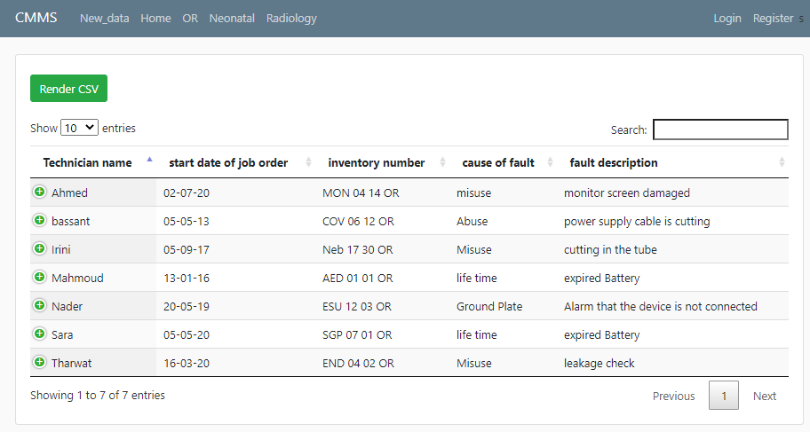

# CMMS-Website
It is CMMS application for hospitals, which stands for Computerized Maintenance Management System. It is a software designed to simplify maintenance management of medical equipments.

# The Application is hosted in Heroku 
You can directly run it through this link [CMMS-Website](https://cmmssoftware.herokuapp.com/)

#  How to run application using the source code
**1) go inside folder containing run.py**

**2) open a terminal by writing cmd in up bar**

**3) write : python run.py**
# How to  work 

1. Browse CSV file of your hospital to save time registering each device.

2. Click upload.
3. You will be directed to home page, where you can press render CSV to see
your uploaded data.

4. You can search for the desired device in “Search” bar and all instances of your
selected device will be rendered.

5. You can press “+” button beside each data to see more information about each device.

6. Up in blue bar, you can choose from “OR”,” Neonatal” and” Radiology” to see data of
your wanted department.

7. Press your preferred department.
8. Inside it, you will see “Repair” and “installation” section.
9. Press any of them and click render CSV and to show your selected data.

10. Click on register to add a new device and in department select your department from
"OR"," Neonatal" or "Radiology" and data will be added to this department only and to the
main data.

11. You can log in with your preferred device and in the account page.

Also, you can see all the
data about your device and change it, your change will appear in CSV with the old change to
remind you later of all of your changes to that device.

12. In the login page, inside the bar you can see calendar .you can add any reminder you
want to remind you regularly by email.

# Video 
<!-- blank line -->
<figure class="video_container">
  <video controls="true" allowfullscreen="true" poster="screen6.PNG">
    <source src="video.mp4" type="video/mp4">
    <source src="video.ogg" type="video/ogg">
    <source src="video.webm" type="video/webm">
  </video>
</figure>
<!-- blank line -->
<video width="320" height="240" controls>
  <source src="video.mov" type="video/mp4">
</video>

